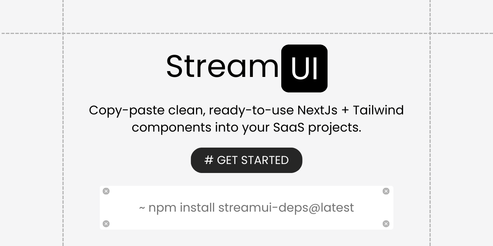

# StreamUI

🚀 **StreamUI** is a copy-paste-friendly React + Tailwind SaaS component library that helps you build beautiful, consistent interfaces faster.

## 📦 What is StreamUI?

- A collection of **ready-to-use, beautifully designed components**.
- **Copy-paste or install once** and use directly in your projects.
- Includes SaaS-specific components like login forms, pricing sections, dashboards, and more.
- Built with **Next.js, React, and TailwindCSS**.

---

## 🛠️ Getting Started

Clone the repo:

```bash
git clone https://github.com/yourusername/streamui.git
cd streamui
npm install
```

Run the development server:

```bash
npm run dev
```

Open [http://localhost:3000](http://localhost:3000) to view the site.

---

### ⚡ Generating Showcase Data

StreamUI uses an automated script to generate `showcase-data.json` for the dynamic component showcase.

Run:

```bash
npm run generate:showcase
```

This will:
- Extract readable props from your hardcoded implementations.
- Automatically generate a clean `showcase-data.json` used in the showcase gallery.
- Preserve your manual `implementation` entries while keeping your props up to date.

Run this whenever you add or update components to keep your showcase data current.

---

## 📚 Documentation

Explore component usage, props, and previews:

- **Gallery:** Browse all available components visually.
- **Documentation:** Step-by-step usage, integration, and customization guidance.
- **Examples:** See real-world usage with SaaS-focused layouts.

---

## 🚀 Deployment

Deploy seamlessly using [Vercel](https://vercel.com/) or your preferred platform:

```bash
vercel
```

---

## 🤝 Contributing

Contributions, component designs, and issue reports are welcome!

1. Fork the repository.
2. Create your feature branch (`git checkout -b feature/new-component`).
3. Commit your changes (`git commit -m 'Add new component'`).
4. Push to the branch (`git push origin feature/new-component`).
5. Open a Pull Request.

---

## 📄 License

MIT License © 2025 Sohan Rout

---

## 💫 Stay Connected

If you enjoy using StreamUI, share it with your friends and tag the library! Contributions and stars are always appreciated ⭐️
